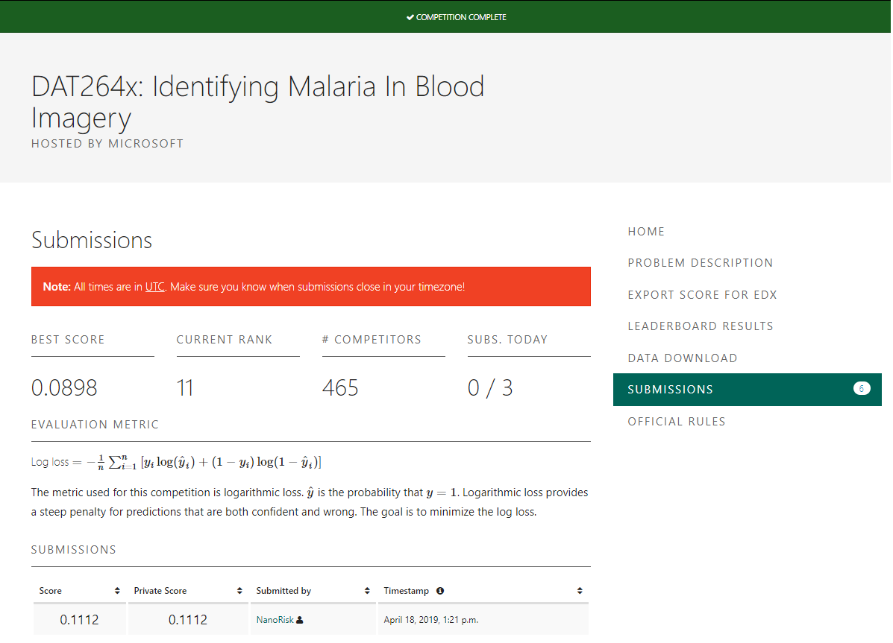

# DAT264x Identifying Malaria

Microsoft Professional Program for Artificial Intelligence capstone project which ended June 30, 2019. Achieved top 2% on the leaderboard (11/465) using a 5 model ensemble of DenseNet121s.

  
  

